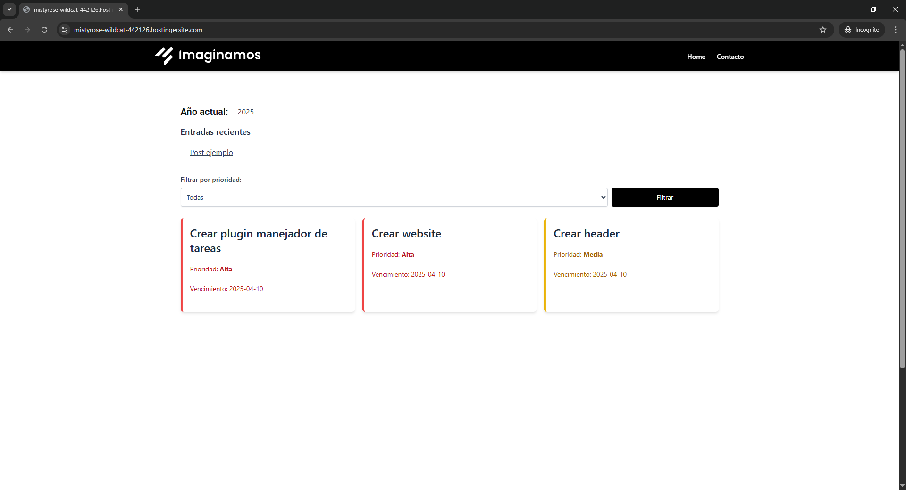
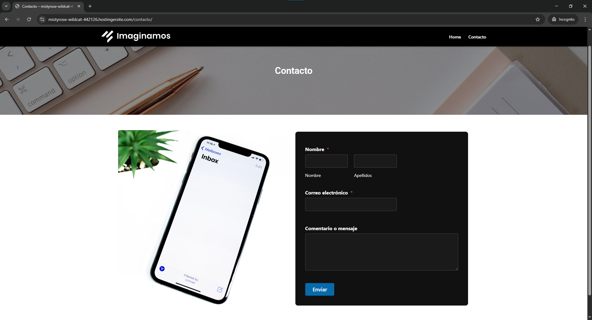
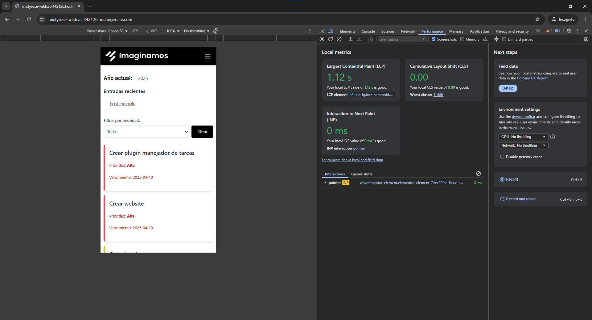
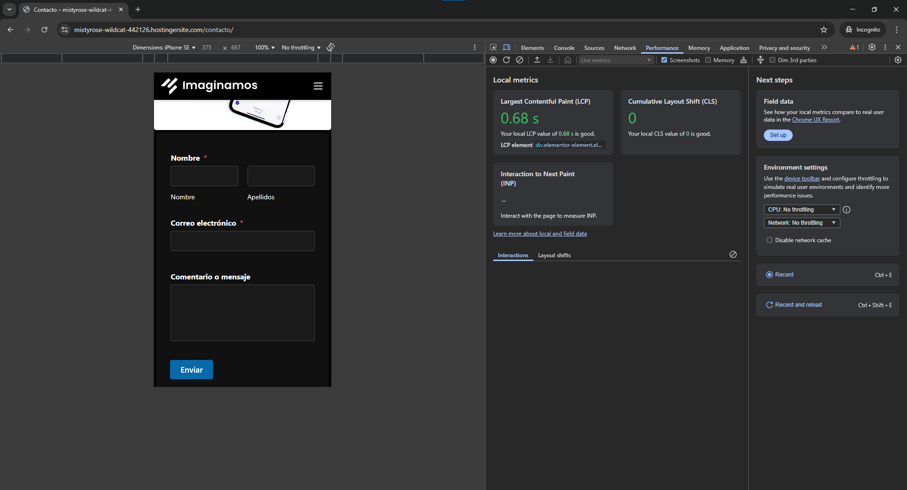

# 📋 Manejador de Tareas

Plugin personalizado para WordPress que permite registrar tareas con campos personalizados y mostrarlas mediante un shortcode.

## 🚀 Funcionalidades

- Registra un **Custom Post Type** llamado `Tarea`.
- Añade campos personalizados:
  - Prioridad (Alta, Media, Baja)
  - Fecha de vencimiento (datepicker)
- Guarda los datos como metadatos.
- Muestra tareas pendientes usando el shortcode `[lista_tareas]`, ordenadas por prioridad.

## 🧩 Uso

### Crear una tarea
1. Ir al panel de administración: `Tareas > Añadir nueva`.
2. Escribir un título (ej. “Publicar artículo”).
3. Seleccionar prioridad y fecha de vencimiento.
4. Publicar.

### Mostrar tareas en una página
Agrega el siguiente shortcode en el contenido de una página o entrada:
[lista_tareas]

### Mostrar año actual
Agrega el siguiente shortcode en el contenido de una página o entrada:
[year_actual]

## 🧩 Vista de la lista de tareas

## 🧩 Vista de contacto

## 📱 Lista de tareas responsive en mobile

## 📱 Lista de contacto responsive en mobile

## 🛠️ Estructura del plugin

- `manejador-de-tareas.php`: archivo principal del plugin.
- Utiliza `register_post_type`, metaboxes personalizados, y `WP_Query`.

## ✅ Estado

Plugin funcional y probado en WordPress 6.x con tema Astra.

## 📦 Instalación

1. Sube la carpeta `manejador-de-tareas` a `/wp-content/plugins/`.
2. Activa el plugin desde el panel de WordPress.

## ✍️ Autor

Desarrollado por Juan Garcés para prueba técnica WordPress.
